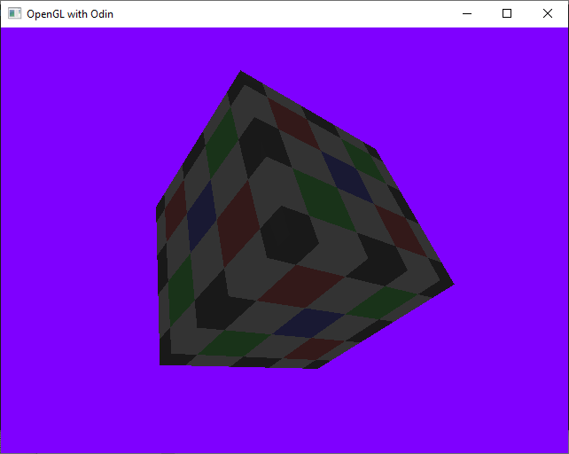
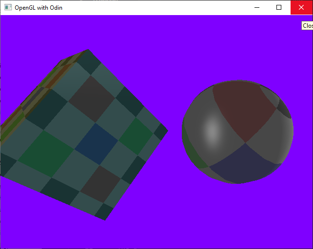

# odinplayground
Odin language playground. 
Learning the Odin programming lang

See
https://odin-lang.org/docs/overview/

The odin environment on x64 windows weighs in at about 375 MB.
It is a batteries included language. Lib files for popular graphics libraries are included.

The spinning cube example here should compile 
without any external dependencies.
Just do 
  odin run opengl_textured_cube.odin -file

# OpenGL Resources
Joe Groffs OpenGL tutorial: https://duriansoftware.com/joe/an-intro-to-modern-opengl.-chapter-3:-3d-transformation-and-projection
Code: https://github.com/jckarter/hello-gl-ch3

# Other Odin examples
https://github.com/odin-lang/examples